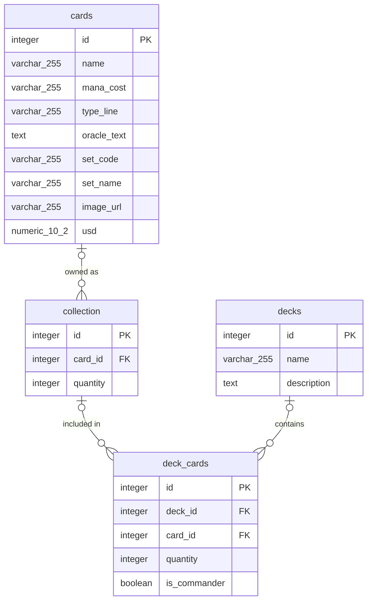

## Structure

```
client/   React app — card browser, collection, and deck views
server/   Express API
```

## Setup

```bash
npm install
```

Copy `.env.example` to `.env` at the project root and fill in the database
credentials (`POSTGRES_USER`, `POSTGRES_PASSWORD`, `POSTGRES_DB`,
`SERVER_PORT`, `DATABASE_URL`). `DATABASE_URL`.

Bring the stack up, then run migrations and seed data inside the server
container:

```bash
docker-compose up -d
docker-compose exec server npx knex migrate:latest
docker-compose exec server npx knex seed:run
```

## API

| Route                              | Methods           | Description                                     |
| ---------------------------------- | ----------------- | ----------------------------------------------- |
| `/cards`                           | GET               | List all cards                                  |
| `/collection`                      | GET, POST         | View collection, add a card (qty +1)            |
| `/collection/:cardID`              | PUT, DELETE       | Set quantity / remove from collection           |
| `/decks`                           | GET, POST         | List decks, create a deck                       |
| `/decks/:deckID`                   | GET, POST, DELETE | Deck detail (with cards), add card, delete deck |
| `/decks/:deckID/cards/:deckCardID` | DELETE            | Remove a card from a deck                       |

## ERD



## Data

`server/data/` holds the seed data.
